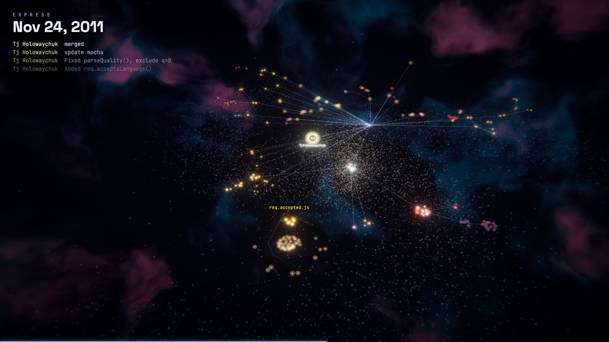
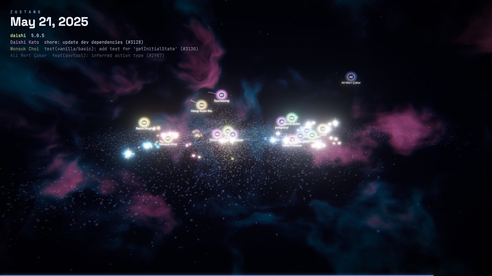
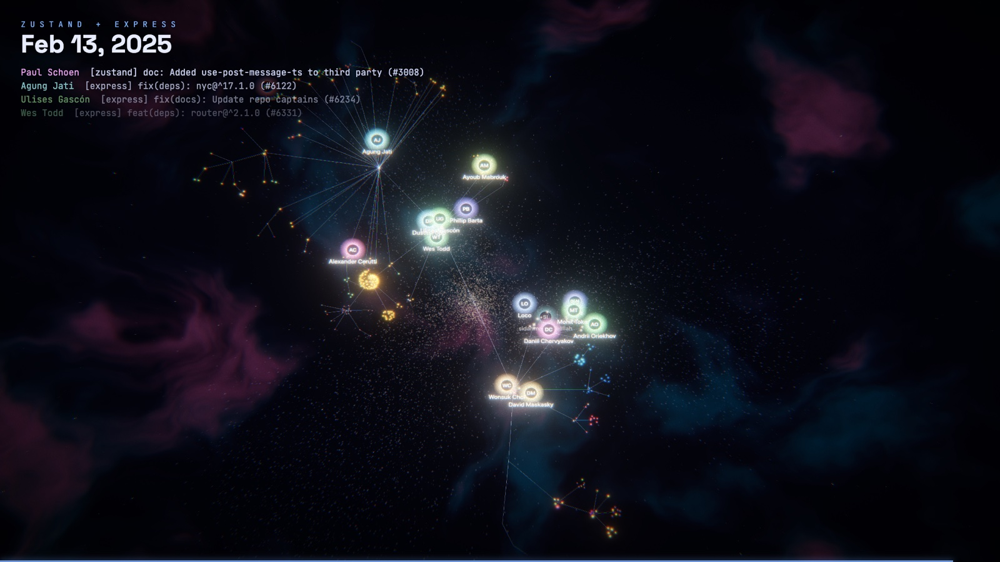
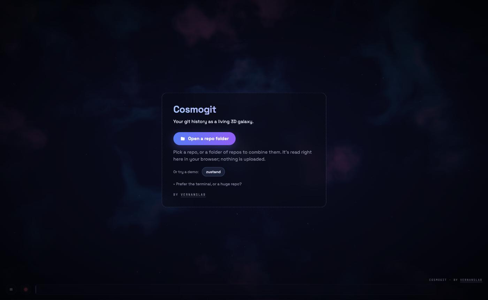

# Cosmogit

Your git history as a living 3D galaxy, rebuilt for the browser with Three.js on WebGPU (with automatic WebGL2 fallback). A tribute to [Gource](https://gource.io/).



<table>
  <tr>
    <td></td>
    <td></td>
  </tr>
  <tr>
    <td align="center"><sub>zustand, skimming the galactic plane</sub></td>
    <td align="center"><sub>zustand + express combined: one arm per repo</sub></td>
  </tr>
</table>

<p align="center"></p>

- **Directories are star systems.** The repo root is the galactic core, and subtrees fan out into spiral arms.
- **Files are stars.** Colour comes from the extension and size from the line count. Recently touched stars burn blue-white and cool to a dim red.
- **Contributors are comets.** They fly to the files they change and fire beams at them.
  - A new file goes supernova with a shockwave.
  - An edit pulses the star, scaled by the diff size (green when lines are mostly added, red when mostly removed).
  - A deleted file implodes into dust.
  - A renamed file streaks across the galaxy to its new home.
- **Cinematic camera** that cuts between shots (orbit, swoop, skim the galactic plane, overhead, chase the busiest contributor, wide), banks into turns and dollies in on big commits. An energy slider sets how restless it is. Drag to take over; it returns to auto after 10 s of no input.
- **Procedural sound**: a pentatonic note per change. File type sets the pitch, diff size the loudness, and the author the instrument.
- **Recording** (● button or `r`): MP4 at 720p to 4K, 30/60 fps, rendered offline at a fixed timestep with the HUD and the soundtrack. With `pnpm dev` it saves into `exports/`.
- HDR bloom, chromatic aberration, bokeh depth of field, nebula skybox and film grain.
- **GPU-driven:** star motion runs in a WebGPU compute shader; 100k files render in about 3 ms a frame.

## Try it

Open **https://cosmogit.web.app** and click **Open a repo folder**. Pick a repo, or a folder containing several repos to combine them into one galaxy. The history is read from `.git` right in your browser (via [isomorphic-git](https://isomorphic-git.org/)); nothing is uploaded. Chrome and Edge open the folder directly; Safari and Firefox read it as a folder upload.

Prefer the terminal, or have a huge repo? Run this inside a repo (or a folder of repos) and drop the `<name>.cosmogit.json` it writes on the page:

```sh
curl -fsSL https://cosmogit.web.app/get | node          # add `node - --first-parent` for mainline only
```

By Max Flach · [VernansLab](https://vernanslab.ai).

## Usage (local)

```sh
pnpm install
pnpm cosmogit ~/code/some-repo              # extract history and open the viewer
pnpm cosmogit ~/code/some-repo --first-parent   # mainline only (exact final tree)
```

Or extract a log and drop it on the page (`pnpm dev`):

```sh
pnpm extract ~/code/some-repo --out logs/some-repo.json
pnpm extract ~/code/api ~/code/web --name platform --out logs/platform.json   # combine repos
```

The viewer also accepts Gource custom logs (`gource --output-custom-log`). Add `?webgl` to the URL to force the WebGL2 fallback.

Logs in `logs/` (gitignored, dev server only, never part of a build) show up as buttons on the start screen.

### Keys

| key | action |
|---|---|
| space | play / pause |
| ← → | seek ±2% |
| + − | speed up / slow down |
| c | toggle auto / free camera |
| n | next camera shot |
| r | record MP4 (whole history, with sound) / stop |
| m | mute |
| h | hide HUD |
| Esc | stop an export |

Everything else (speed, look, layout, post FX, camera, sound, export) is in the **Cosmogit** panel, top right.

## How it works

```
cli/extract.ts      git log --raw --numstat -> events JSON
src/data/           log parsers (git, Gource custom log)
src/sim/            RepoState (file tree over time), Playback (clock, idle skipping, seek)
src/layout/         deterministic galaxy layout with spring easing
src/render/         TSL materials + compute: stars, filaments, particles, contributors, dust, nebula, post FX
src/camera/         cinematic director + OrbitControls handoff
src/audio/          Tone.js sonifier
src/export/         fixed-timestep WebCodecs MP4 export (mediabunny)
```

History is linearised in `--date-order`. Long-lived release branches that keep touching files deleted on master can leave a few extra stars behind; `--first-parent` gives an exact tree.

## Share a private repo by link

```sh
pnpm share ~/code/my-repo                 # pull, extract (emails stripped), build, deploy
pnpm share ~/code/workspace --name mdl     # a folder of repos, combined
```

Prints an unlisted link like `https://cosmogit.web.app/s/<id>` (not indexed, but anyone with it can see commit messages, file paths and author names). Re-running updates the same link; `--new` rotates it. The data lives in the gitignored `shared/` folder and is copied into the build, so deploy from the machine that has it, or the links disappear.

## Deploy

```sh
pnpm deploy   # build + firebase deploy --only hosting (project: cosmogit)
```

`pnpm build` also bundles `cli/get.ts` into `dist/get`, the script behind the one-liner.

## Credits

Cosmogit exists because of **[Gource](https://gource.io/)** by Andrew Caudwell, the original software version control visualization. The idea of replaying a repository's history as a living tree, with contributors flying around and zapping files as they change them, is Gource's. Cosmogit reimagines it in 3D for the browser; it is an independent implementation and shares no code with Gource (which is GPL-3.0). If you want the classic, go use Gource.

Built with [Three.js](https://threejs.org/) (WebGPU + TSL), [Tone.js](https://tonejs.github.io/) and [Mediabunny](https://mediabunny.dev/).

By Max Flach · [VernansLab](https://vernanslab.ai).

## License

[MIT](LICENSE) © Max Flach (VernansLab). Dependencies keep their own licenses (Three.js, Tone.js, isomorphic-git and Tweakpane are MIT; Mediabunny is MPL-2.0).
